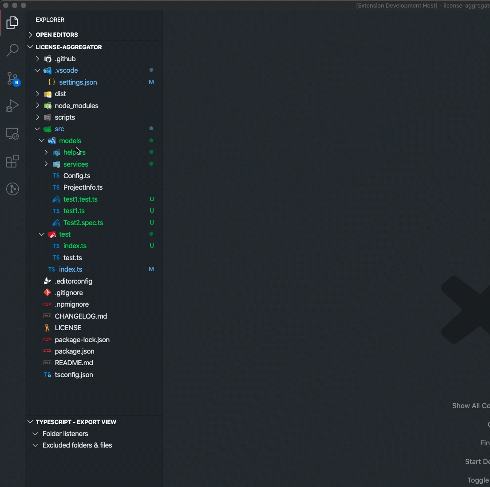
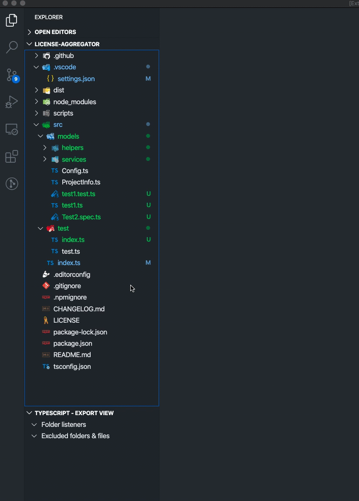
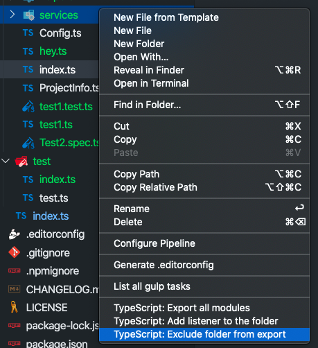
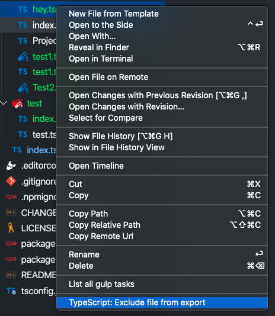
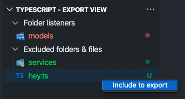

# TypeScript Barrel Generator

&nbsp;&nbsp;

&nbsp;&nbsp;

Working with TypeScript? Want to make your TypeScript imports cleaner? Use this extension to easily export all modules to a barrel `index.ts` file.

## Functionalities

The extension allows you to manually or automatically export the modules to a barrel file. For the automatic way, you first have to create a listener for the folder for which you want to create the automated export. 

In both the manual and automatic way, an `index.ts` file will be created with a reference to all the folder/files in the current directory.

> **Info**: If there are folders/files you want to get excluded from the export, you can do this by right-clicking on the folder/file and clicking on the `TypeScript: Exclude folder/file from export`.

### Manual creation

### Module creation by listener

> **Info**: When a folder listener is added, it will be visible in the `TypeScript - Export Listeners` view. By clicking on the folder names, you will automatically open the `index.ts` file.

#### Removing a listener

Folder listeners can be removed by right-clicking on the folder name in the `TypeScript - Export View`.

### Excluding folder(s)/file(s)

If there are specific folders or files you want to exclude from your module, you can do this by right-clicking on the file, and click on the `TypeScript: Exclude folder/file from export` menu action.

#### Include previously excluded folder(s)/file(s)

When you already excluded a folder or file, and want to include these again into your module export, you can do this from the `TypeScript - Export View`. Under the `Excluded folders & files` section, right-click on the folder or file to include and click `Include to export`.

## Configuration / Settings

The extension makes use of the following settings:

| Setting | Description | Type | Default |
| --- | --- | --- | --- |
| `exportall.config.includeFoldersToExport` | Specifies if folder (which contain a `index.ts` file) will also be included in the module export. | boolean | `true` |
| `exportall.config.exclude` | Specify which files you want to exclude the `index.ts` file. Works on the whole filename or part of the filename. | string[] | `['.test.', '.spec.']` |
| `exportall.config.folderListener` | Specify the relative paths for the folder listeners. This will make it possible to automatically generate the module export once a file gets added/updated/removed within the specified folder. | string[] | `[]` |
| `exportall.config.relExclusion` | Specify the relative folder/file paths to exclude from the export. | string[] | `[]` |

## Contribute

Experiencing any issues, or got feedback to share? Feel free to raise this in the issue list of the repo: [issues](https://github.com/estruyf/vscode-typescript-exportallmodules/issues).